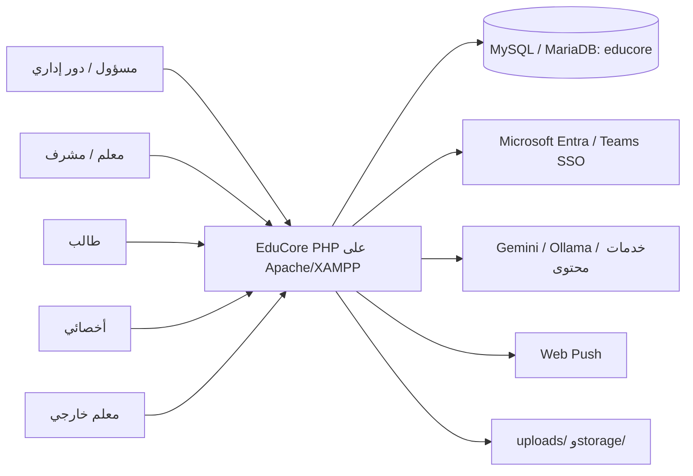
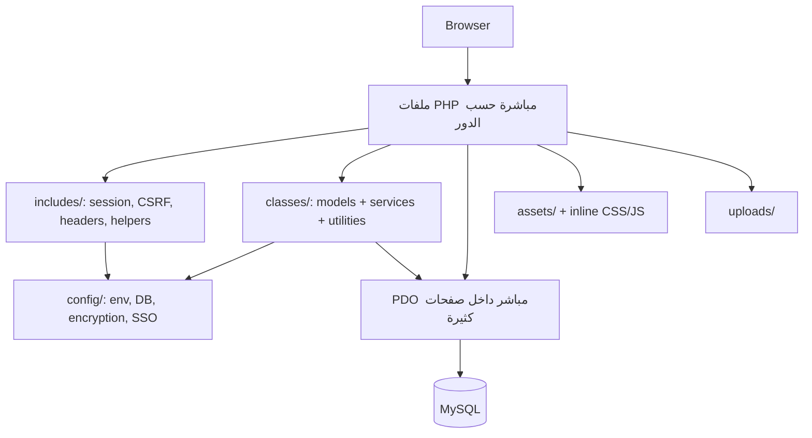
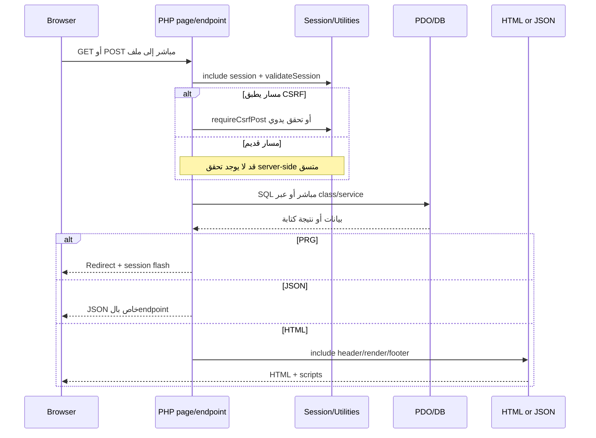
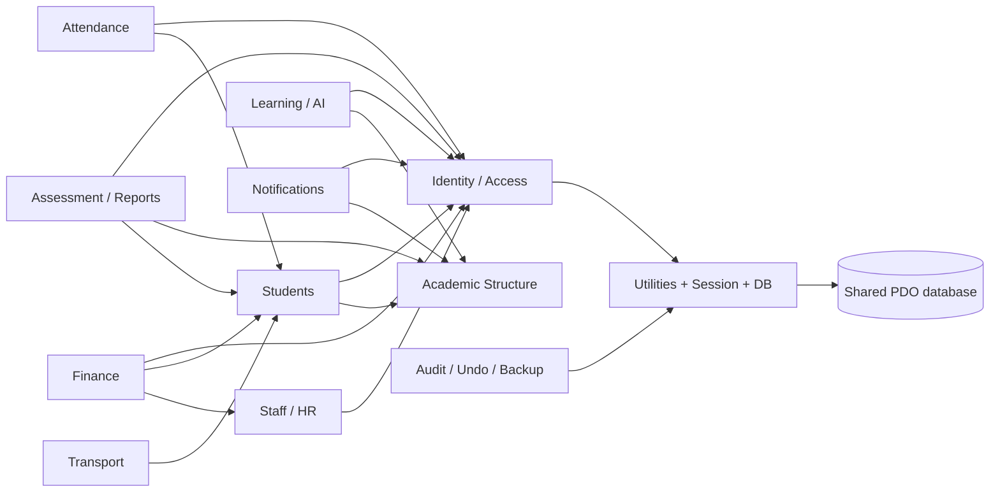
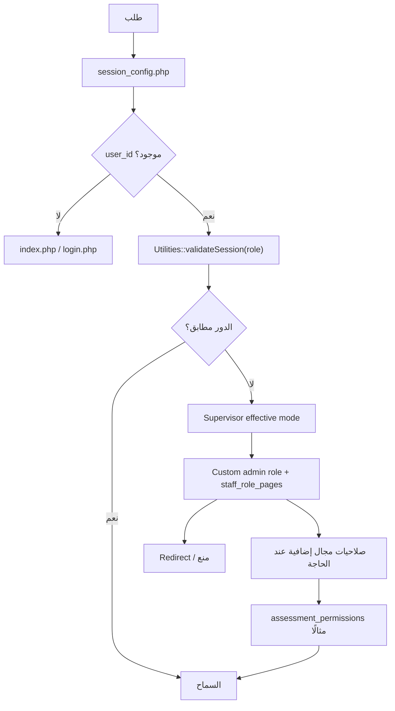
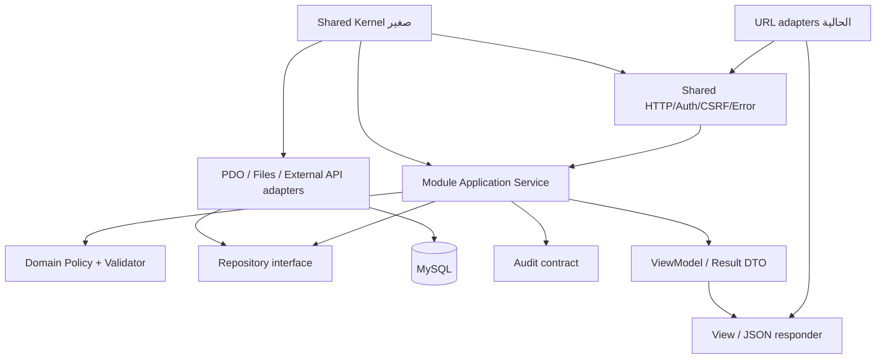
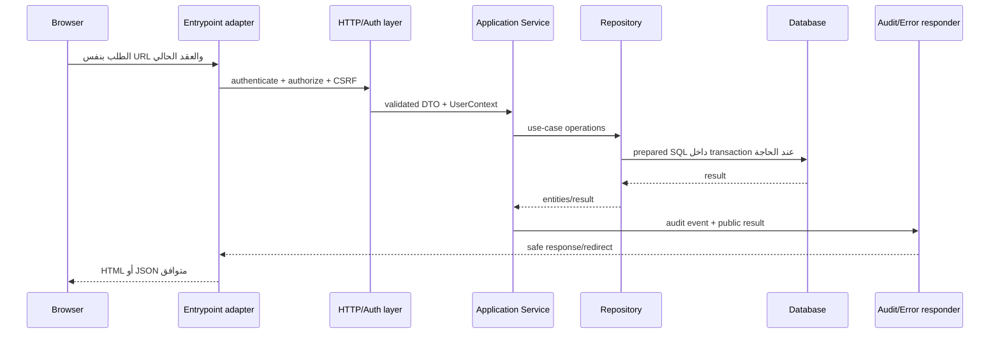
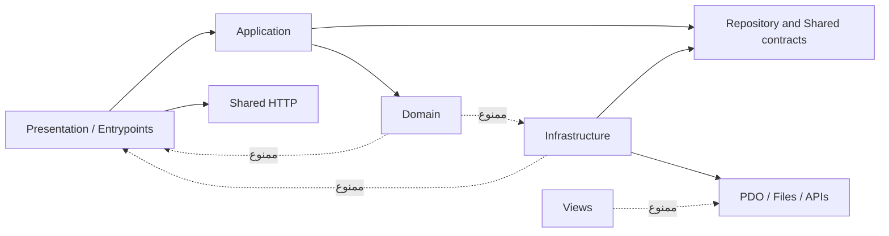
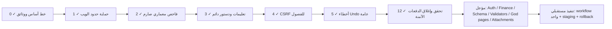

# الرسومات المعمارية

## 1. سياق النظام الحالي

## 2. مكونات التطبيق الحالي

## 3. دورة الطلب الحالية

## 4. اعتماديات الوحدات الحالية

الأسهم تمثل قراءة/اعتماد فعليًا شائعًا، ولا تدعي ملكية حصرية لكل جدول.

## 5. تدفق المصادقة والتفويض الحالي

## 6. المعمارية المستهدفة

## 7. دورة الطلب المستهدفة

## 8. قواعد اعتماد الوحدات المستهدفة

## 9. مراحل الانتقال

## تحقق الصياغة

كل رسم يستخدم أسماء مكونات مثبتة أو أسماء مستهدفة معرفة صراحة في وثيقة المعمارية المستهدفة. العلاقات غير المؤكدة لم تُعرض كحقائق تفصيلية.

أعيدت مراجعة الرسومات في 2026-07-13. لم تتغير المكونات أو نقاط الدخول لأن الدفعات الآمنة لم تنقل ملفات؛ حُدث رسم المراحل وحده لتمييز المنفذ فعليًا عن العمل المؤجل.
